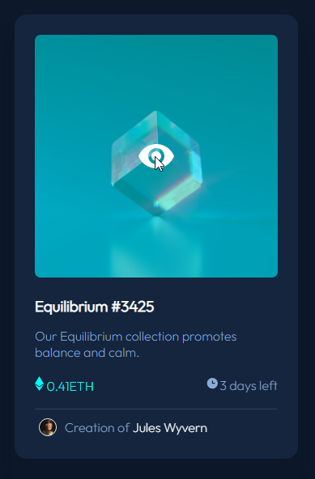
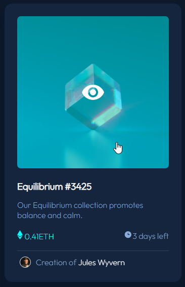

# Frontend Mentor - NFT preview card component solution

This is a solution to the [NFT preview card component challenge on Frontend Mentor](https://www.frontendmentor.io/challenges/nft-preview-card-component-SbdUL_w0U). Frontend Mentor challenges help you improve your coding skills by building realistic projects. 

## Table of contents

- [Overview](#overview)
- [Links](#links)
- [My process](#my-process)
- [Built with](#built-with)
- [What I learned](#what-i-learned)

## Overview
- this is my absolute first project
- since the card is already small i didn't add any responsive functionality to my project

## Links

- Solution URL: [Add solution URL here](https://github.com/momenkamal221/nft-preview-card-component-main.git)
- Live Site URL: [Add live site URL here](https://momenkamal221.github.io/nft-preview-card-component-main/)

## Built with
- CSS custom properties
- Flexbox
## What I learned
- the **opacity** property
- the position of eye icon was a little tricky for me, just had one problem will notice that the cursor is not pointer when you hover over the eye 

however, the pointer appears when you hover over the image itself  

